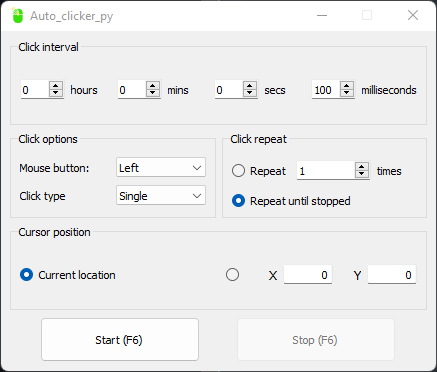

# Auto_clicker_py: Basic, Lightweight, Fast

  

This application is a simplified replica of "OP Auto Clicker 3.0" software.

Replicated features are:
+ Click interval (Delay between each click)
+ Click options with: 
  - Mouse button (Left , Right, Middle buttons handled)
  - Click type (Single click and Double click handled)
+ Click repeat in which you select how many click iterations you need
+ Cursor position with:
  - Current location in order to click where your cursor is
  - To any coordinates within the size of your monitor screen

## How to use Auto_clicker_py

Modify any inputs you need and then click on start button.
When you want to interrupt the process, click on the stop button.

Shortcut hot key is "F6".

## Credits

This project was made without using any tutorial, I have just tried to make the closest
replica of "OP Auto Clicker 3.0" app. (Mine is surprisingly faster ! If it isn't for you send me a mail with proofs!).

Requirements needed for this application were:
- PyQt5~=5.15.6
- pynput~=1.7.6
- screeninfo~=0.8
